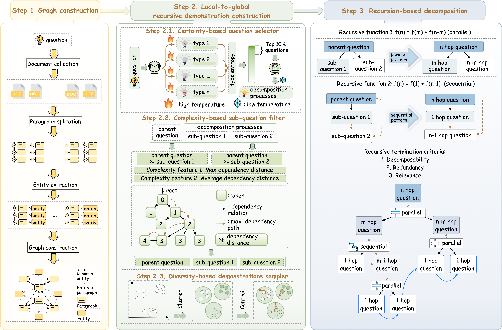

# RSLG: Recursive Short-to-Long Generalization for Multi-hop Reasoning

## 🚀 Overview
This repository contains the official implementation for the paper **"Recursive Short-to-Long Generalization for Multi-hop Reasoning"**.


## 📂 Repository Structure

```
RSLG-main/
├── 📁 data/              # Dataset files (downloaded separately)
├── 📁 evaluation/        # Evaluation scripts and files
├── 📁 generate_demonstrations/  # Demonstration generation
├── 📁 lora/              # LoRA components (downloaded separately)
├── 📁 prompt/            # Prompt templates and utilities
│
├── 📄 evaluate_results.py    # Results evaluation script
├── 📄 generate_final_result.py  # Final result generation
├── 📄 gpt_runner.py        # GPT model runner
├── 📄 llm_runner.py        # Open source model runner
├── 📄 main.py              # Main execution script
├── 📄 parse.py             # Parsing utilities
├── 📄 model.png            # Model picture
├── 📄 prompt.py            # Prompt for evaluation
├── 📄 README.md            # This documentation
├── 📄 requirements.py      # Requirements
├── 📄 retriever.py         # Retrieval components
└── 📄 utils.py             # Utility functions
```
## ⚙️ Create a conda environment and install dependencies:

```
conda create -n RSLG-envior python=3.9
conda activate RSLG-envior
pip install -r requirements.txt
```

## 📥 Download data to corresponding folders
```
File: data.zip
Google Drive: https://drive.google.com/file/d/11sd4GNXLH3ZL16GB-pt20Tus3ILM2DUG/view?usp=share_link
Baidu Cloud: https://pan.baidu.com/s/1qCZ810ciB_bI8MzT8rhPMA (Code: 2869)

File: lora.zip
Google Drive: https://drive.google.com/file/d/1VJJ9ghAIlMaf3O4WnmoIBKzEmvgm1dkJ/view?usp=sharing
Baidu Cloud: https://pan.baidu.com/s/1wv1hgCBTTAG07bac1IE-cA (Code: 2869)
```
## 🚀 Execution Steps
### 1. Reasoning and retrieve
```
python main.py  --llm 'llama' --train_dataset 'hotpotqa' --test_dataset 'longhopqa'
```
### 2. Generate the final results
```
python generate_final_result.py --llm 'llama' --train_dataset 'hotpotqa' --test_dataset 'longhopqa'
```
### 3. Evaluation
```
python evaluate_results.py --llm 'llama' --train_dataset "hotpotqa" --test_dataset "longhopqa"
```